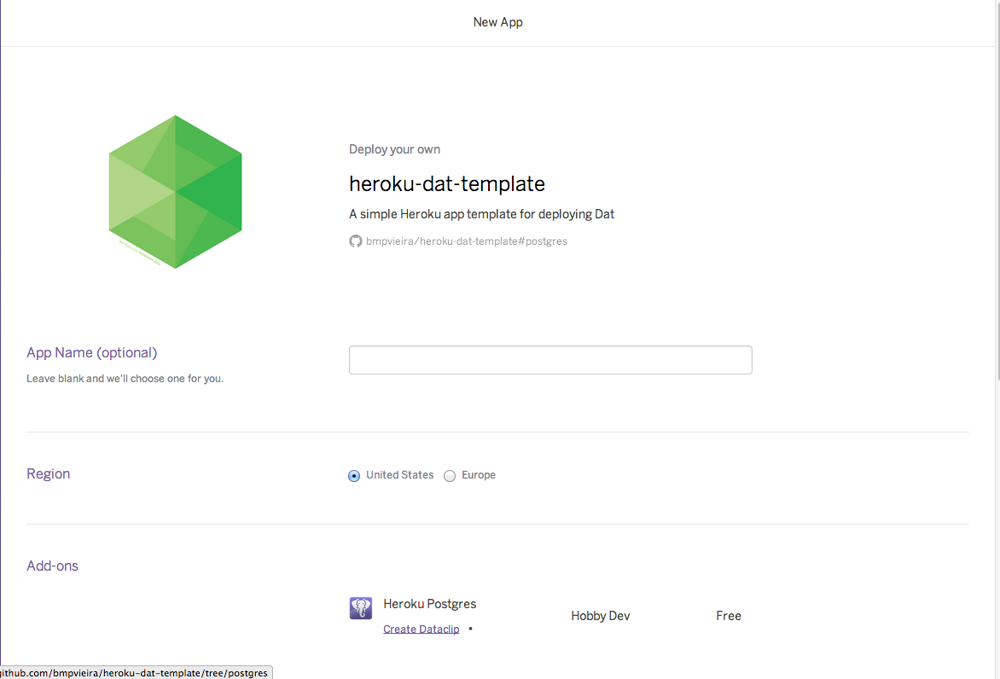
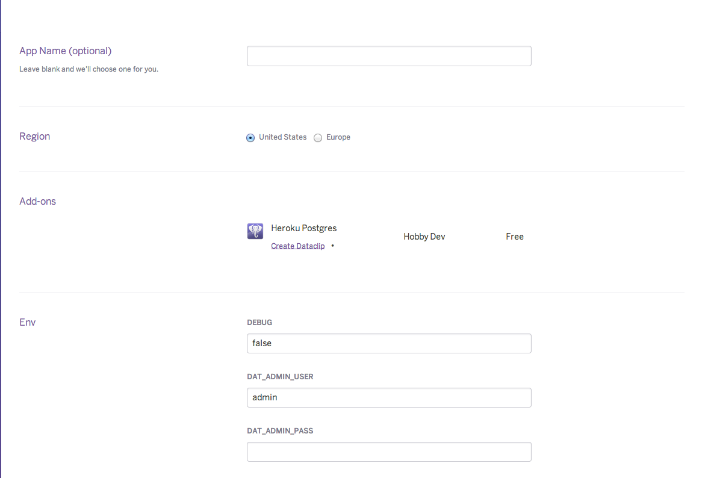
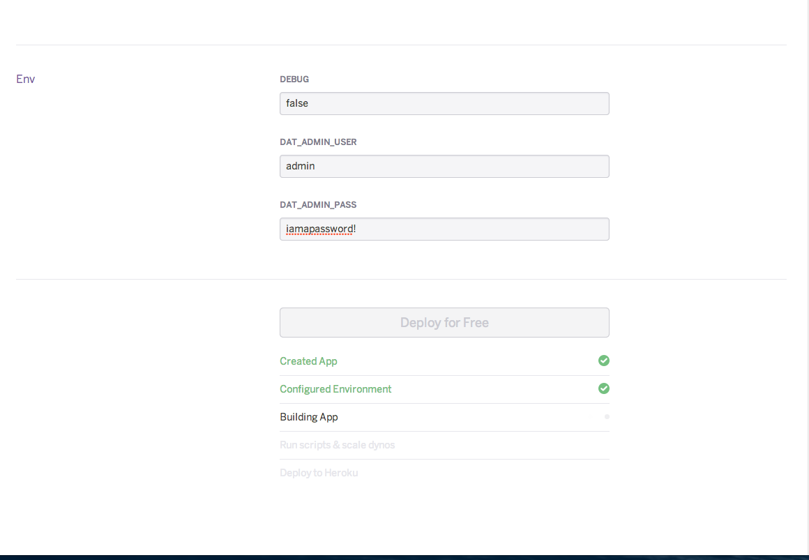
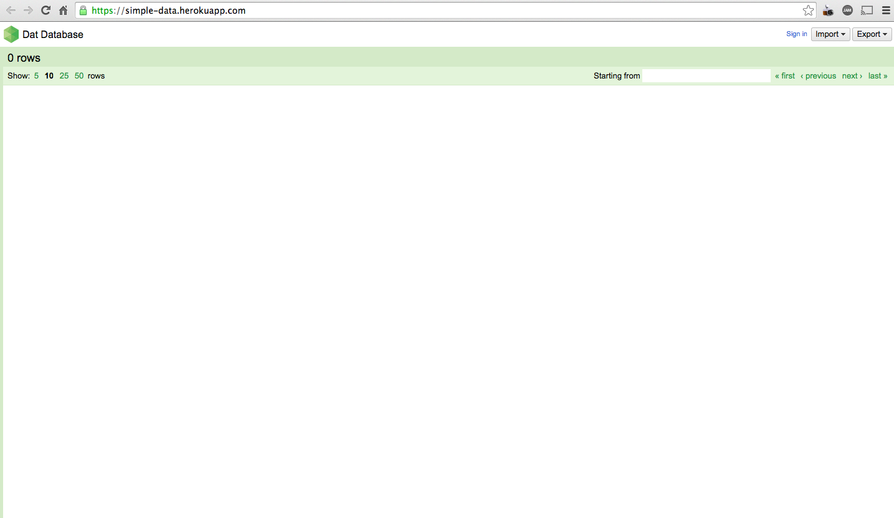

Heroku-dat-template
===================

## A simple Heroku app template for deploying [Dat](http://github.com/maxogden/dat)

This repo allows you to easily deploy dat on heroku. More information about each of the three deployment methods can be found below:

### Temporary Data Storage
Deploy a dat on the Heroku [Ephemeral Filesystem](https://devcenter.heroku.com/articles/dynos#ephemeral-filesystem). Data will be temporary. This is the best option for testing and playing around with dat.

[](https://heroku.com/deploy?template=https://github.com/bmpvieira/heroku-dat-template.git)

### Permanent Data Storage
Data will get stored permanently and be available to clone as long as the app remains active.

**Option 1.** [Heroku Postgres](https://addons.heroku.com/heroku-postgresql)
10,000 rows free.

[](https://heroku.com/deploy?template=https://github.com/bmpvieira/heroku-dat-template/tree/postgres)

**Option 2.** [Redis Cloud](https://addons.heroku.com/rediscloud)
25MB free. This is a high-performance service with no database connection limit.

[](https://heroku.com/deploy?template=https://github.com/bmpvieira/heroku-dat-template/tree/redis)


_Note: Only tabular data is stored in postgres/redis. Blobs will still be stored on the ephemeral filesystem (unless you fork this and put in your own blob backend)_


Usage
-----
After hitting one of the purple buttons, and logging into herkou, you'll see this screen:



You should enter a unique, memorable name for your dat. It will be available at *name*.herokuapp.com.

Then, scroll down.

You will see a place to enter your app and environment variables.


* `DEBUG`
  - defaults to `false`
  - `*` enables debug mode.
  - view logs with ```heroku logs```

* `DAT_ADMIN_USER`
* `DAT_ADMIN_PASS`
  - If empty, your dat has no authentication. That means anyone with the URL can change the data.
  - Keep these secret, only give them to people you trust!

Once you enter in your desired options, hit the "Deploy" button.

You might need to wait a couple of minutes while heroku starts.



You can then click "view" and your dat will be available at *name*.herokuapp.com.



Troubleshooting
---------------

Dat is still in alpha. If you have any trouble, it's probably because we did something wrong! Please tell us by opening an issue here or going to #dat on IRC in freenode.


<!-- https://devcenter.heroku.com/articles/heroku-button -->
<!-- http://expeditedssl.com/heroku-button-maker -->

License
-------
[MIT](https://raw.github.com/bmpvieira/heroku-dat/master/LICENSE)
